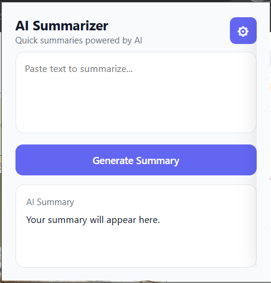
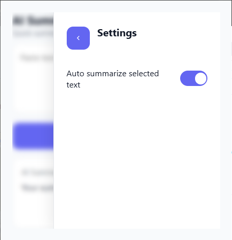

<h1 align="center" style="display:flex; align-items:center; justify-content:center; gap:12px;">
  
  AI Summarizer Chrome Extension
</h1>

  
  

## Project Overview

AI Summarizer is a Chrome extension that lets you quickly generate concise summaries of selected text or custom input using an AI-powered backend. It adds a context menu option ("Summarize with AI") and a popup UI for manually pasting text, making it easy to get TL;DR-style summaries while browsing.

The extension communicates with a local Node.js server that exposes a `/summarize` endpoint. The server handles the actual summarization logic (for example, by calling an LLM API) and returns the summary text to the extension.

## Screenshots

  
  

## Backend Setup (Server)

1. Ensure you have **Node.js 18+** installed.
2. Copy the example environment file and fill in your Gemini API details:
  - `cp .env.example .env` (or create `.env` manually based on `.env.example`).
  - Set `GEMINI_API_KEY` and, optionally, tweak `GEMINI_AI_MODEL`.
3. Install and run the Node.js server:
  - `cd server`
  - `npm install`
  - `npm start` (this runs `node server.js` on port `3000`).

The extension expects the server to be reachable at `http://localhost:3000/summarize`.

## Installation (Chrome Extension)

1. With the server running, open **chrome://extensions** in Chrome.
2. Enable **Developer mode** in the top-right corner.
3. Click **Load unpacked** and select the `extension` folder of this project.
4. The "AI Summarizer" extension should now appear in your toolbar.

## Usage

- **From the popup:**
  - Click the extension icon to open the popup.
  - Paste or type the text you want summarized.
  - Click **Generate Summary** to call the backend and display the result.

- **From the context menu:**
  - Select text on any web page.
  - Right-click and choose **"Summarize with AI"**.
  - If "Auto summarize selected text" is enabled in the popup settings, the selected text will be loaded into the popup and summarized automatically.

## Tech Stack

- **Browser**: Chrome Extension Manifest V3
- **Frontend**: HTML, CSS, JavaScript
- **Extension APIs**: `chrome.contextMenus`, `chrome.scripting`, `chrome.storage`, `chrome.runtime`
- **Backend**: Node.js/Express server (in the `server` directory)

## Project Structure

- `manifest.json` – Chrome extension configuration (permissions, background, popup, icons).
- `src/background/background.js` – Sets up the context menu and handles selection events.
- `src/popup/popup.html` – Popup UI for entering text and showing AI summaries.
- `src/popup/popup.js` – Frontend logic for calling the server and managing settings.
- `src/popup/popup.css` – Styles for the popup and settings panel.
- `src/utils/storage.js` – Helpers for saving and retrieving settings from `chrome.storage.local`.
- `icons/` – Extension icons (16x16, 48x48, 128x128).

## Development Notes

- Ensure the summarization backend is running (default: `http://localhost:3000/summarize`).
- If you change the backend URL or add API keys, reflect that in your `.env` file and anywhere in the server code that reads from it.

## License

MIT License
